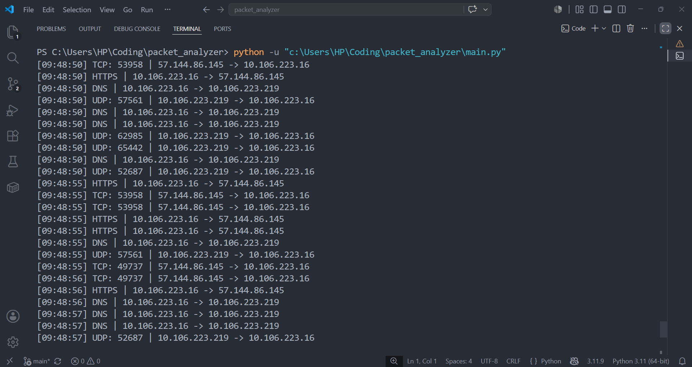
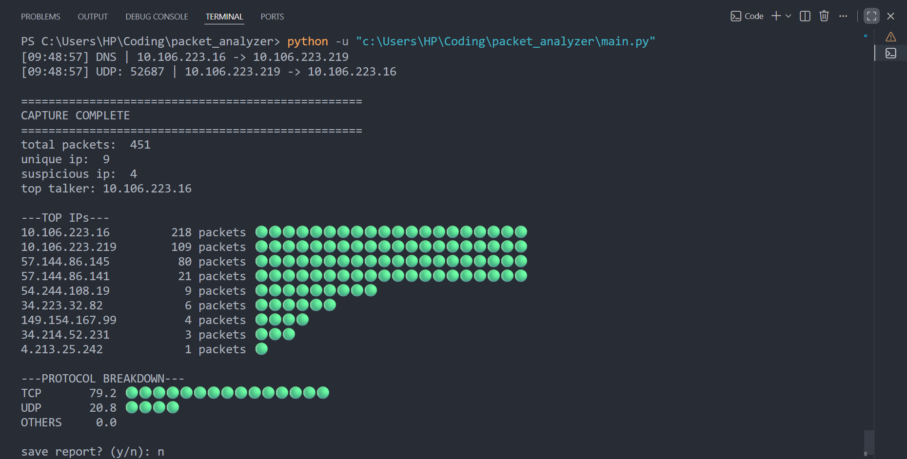

# Network Packet Analyzer

A real-time network packet capture and analysis tool built in Python using Scapy. This project tracks every packet source to destination ,protocol analysis and cybersecurity fundamentals.

## What it does

- Captures live network packets from your machine
- Identifies common protocols such as — TCP, UDP, ICMP
- Detects frequently used services including — HTTPS, DNS, SSH, HTTP
- Counts packets per IP address
- Track packet activity by IP address
- Flags suspicious IPs exceeding packet threshold
- Shows "top talkers" with visual bar chart
- Generates detailed timestamped  reports saved to file

## Sample Output


## Installation

1. Clone the repository
```bash
git clone https://github.com/amlan-sinha07/packet_analyzer.git
cd packet_analyzer
```

2. Install dependencies
```bash
pip install scapy
```

3. Install Npcap (Windows only)
- Download it from https://npcap.com
- During installation, make sure to check the box that says "WinPcap API-compatible mode".

## Usage

Run as Administrator (required for packet capture):
```bash
python main.py
```

This application will ask for:

Enter number of packets to capture and suspicious IP threshold when prompted.

After capture, the analyzer will display statistics and generate a report that can be saved for future reference.

## Technologies

- Python 3.11
- Scapy — packet capture and analysis
- datetime — timestamping
- os — file and folder management

## Author

Amlan Sinha

GitHub: https://github.com/amlan-sinha07